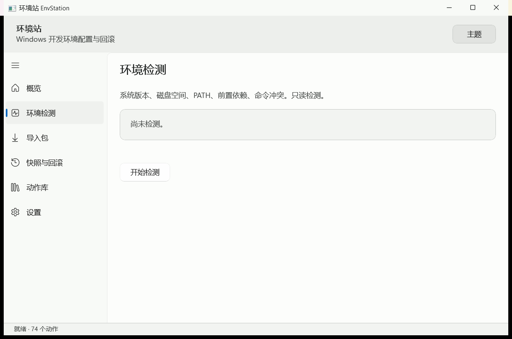
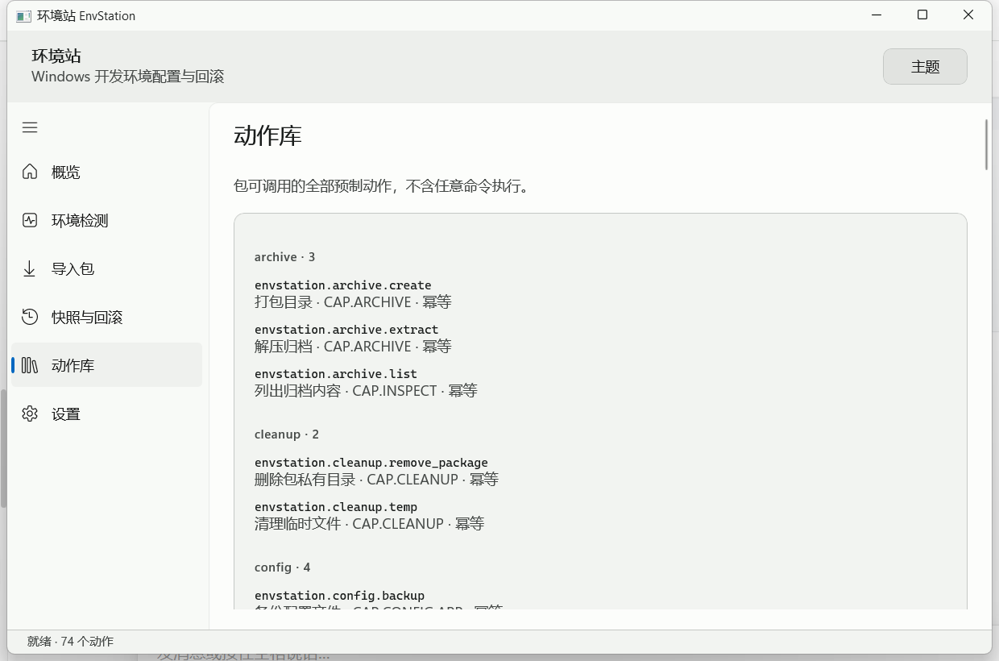
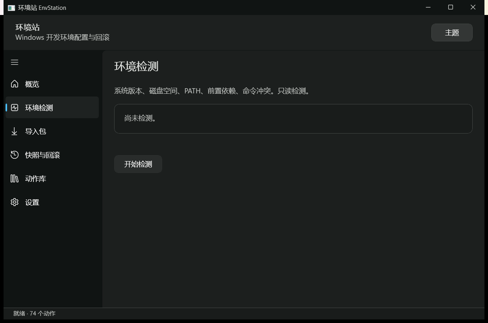
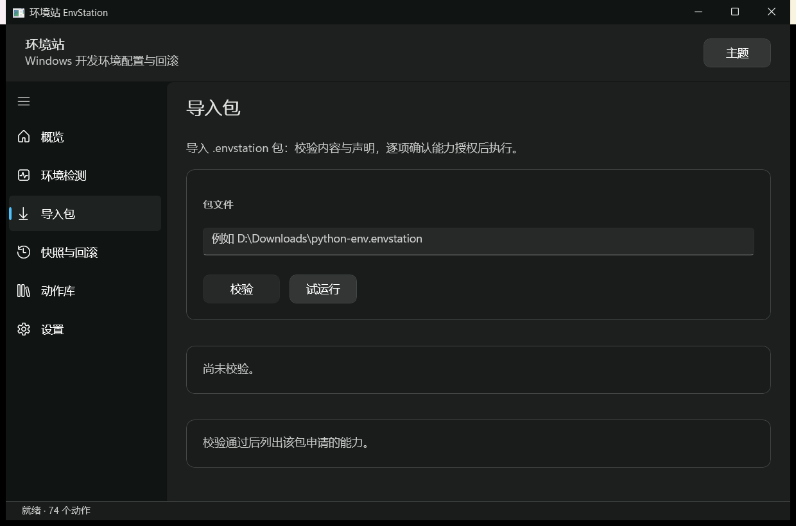

# 环境站 EnvStation

> 一句话简介：面向 Windows 的**开发环境配置与回滚工具**——装运行时、配环境变量、理 PATH、解同名命令冲突，每一步都**可预演、可拒绝、可回滚**。

<!-- 徽章区（Badge） -->

[](https://github.com/bigxingyun/EnvStation/actions)
[](https://github.com/bigxingyun/EnvStation/releases)
[](LICENSE)
[](#已知限制)
[](https://dotnet.microsoft.com/download/dotnet/8.0)
[-0078D6?logo=windows)](https://www.microsoft.com/windows)

> [!WARNING]
> **当前为开发中快照：无发布版本、无安装包（MSI/MSIX）、无代码签名。** 内核、命令行与图形界面均可用，全量验证通过；但环境站会修改环境变量，**请在非关键机器或虚拟机上先行验证**。

---

## 目录

- [项目介绍](#项目介绍)
- [环境依赖 Prerequisites](#环境依赖-prerequisites)
- [安装步骤 Installation](#安装步骤-installation)
- [快速上手 Usage](#快速上手-usage)
- [许可证 License](#许可证-license)

---

## 项目介绍

Windows 上的开发环境是一份**没人维护的隐式状态**：PATH 里躺着十年前的卸载残留、同一台机器上三个 Python 争抢 `python` 命令、换一台机器就得靠记忆重装一遍。EnvStation 把这份隐式状态变成**可检测、可声明、可撤销**的显式状态。

设计上的两条硬约束：

1. **默认只读。** 所有写操作（`run`、`env set`、`path ensure`…）默认只做预演，打印将要发生的每一步；要真正执行必须显式给出 `--apply`，且用 `--allow` 逐项授权能力，**没有「全部同意」开关**。
2. **失败必回滚。** 任何写操作前自动建立快照，任一步骤失败自动回滚到操作前状态。

### 界面预览

| 环境检测 | 动作库 |
| --- | --- |
|  |  |
|  |  |

### 核心功能

| 能力 | 说明 |
| --- | --- |
| **环境检测** | 系统版本与区域、CPU 架构、磁盘可写性、用户级/系统级 PATH 健康度、前置依赖缺失、同名命令冲突 |
| **环境变量与 PATH** | 读写、去重、清理失效条目、diff、校验、快照回滚；用户级与系统级分别处理 |
| **快照与回滚** | 写操作前自动快照，失败自动回滚；快照可浏览与恢复 |
| **包管理** | 导入第三方 `.envstation` 包（声明 + 工作流），经多重校验与能力授权后执行 |
| **预制动作库** | 74 个动作，覆盖探测、下载、解压、安装、环境变量、PATH、配置与镜像源、验证、清理 |
| **声明式工作流** | 包以 TOML 声明步骤，**不支持脚本**；动作契约哈希由 `pack` 自动补全 |
| **安全模型** | 能力三方一致性校验、预演只读环境、可执行文件允许列表、ECDSA P-256 签名、V4 沙箱试运行、JSONL 审计 |
| **双前端** | WinUI 3 图形界面（概览 / 环境检测 / 导入包 / 快照与回滚 / 动作库 / 设置）+ Native AOT 命令行 |

### 适用场景

- **新机初始化**：逐项核对系统、磁盘、PATH、依赖，把「缺什么」变成一份清单，而不是报错信息。
- **环境排障**：命令「时灵时不灵」、`python` / `node` 指向了意料之外的版本——先定位 PATH 异常与同名冲突，再动手改。
- **团队环境标准化**：把一套环境检查与配置流程写成 `.envstation` 包，交给同事一条命令预演后执行。
- **分发可信脚本**：给非开发同事或客户机器做环境配置时，用预演 + 逐项授权替代「以管理员身份运行某个 .bat」。

### 安全设计要点

第三方包**不能执行任意命令**。环境站不提供 `exec`、`shell`、`eval`，包只能从预制动作清单中编排。若允许任意命令，导入第三方包这一功能在实质上即构成远程代码执行通道，而包来源与包作者均不可控。

| 机制 | 说明 |
| --- | --- |
| 能力模型 | 动作声明、包清单声明、用户授权三者不一致即阻断 |
| 预演不可写入 | 预演模式注入只读环境实现，结构上无法修改系统 |
| 可执行文件允许列表 | 仅可信目录下的白名单程序可被调用，参数经 `ArgumentList` 传递 |
| 包验证 | V1 结构 → V2 静态规则 → V3 合规与指纹 → V4 沙箱试运行 |
| 签名 | ECDSA P-256 + SHA-256；不预置官方根密钥，信任锚点由用户逐包确认 |
| 审计 | 每次动作调用落盘 JSONL，按大小轮转 |

V4 沙箱试运行在隔离环境中实跑一遍：只读环境实现、不注入网络、可写根仅限临时目录；执行完毕后比对「声明能力」与「实际调用能力」——声明而未使用仅记为浪费，**使用而未声明则直接阻断**。

---

## 环境依赖 Prerequisites

| 项目 | 要求 |
| --- | --- |
| **操作系统** | Windows 10 1809（build 17763）或更高；Windows 11 |
| **CPU 架构** | x64 或 ARM64 |
| **.NET SDK** | **8.0.425 或更高的 8.0.x**。仓库以 `global.json` 固定 `8.0.425`（`rollForward: latestFeature`），版本不足会直接报错退出 |
| **磁盘空间** | 构建约 1 GB；图形界面自包含发布目录约 160 MB |
| **网络** | 首次构建需从 NuGet 还原 Windows App SDK、SDK 构建工具与 MSIX 工具链 |
| **管理员权限** | **不需要**。主程序以 `asInvoker` 运行，不主动请求提权；系统级环境变量的写入在当前版本不可用 |

### 第三方依赖与服务

| 依赖 | 用途 | 是否必需 |
| --- | --- | --- |
| [NuGet.org](https://www.nuget.org/) | 还原构建依赖（社区版即可） | 构建必需 |
| [.NET 8 SDK](https://dotnet.microsoft.com/download/dotnet/8.0) | 编译与运行 | 必需 |
| `Microsoft.WindowsAppSDK` / `Microsoft.Windows.SDK.BuildTools.MSIX` | WinUI 3 界面与 MSIX 打包工具链 | 随 NuGet 自动还原 |
| Windows App SDK Runtime | 运行图形界面（默认自包含发布，已内嵌） | 通常无需单独安装 |
| Windows SDK / VS「通用 Windows 平台开发」工作负载 | 可选；仓库已用 MSIX 包规避 | 可选 |

运行期**无需任何配置文件**。运行期数据目录为 `%LOCALAPPDATA%\EnvStation`：

| 子目录 | 内容 |
| --- | --- |
| `audit/` | 审计日志 JSONL，按大小轮转 |
| `snapshots/` | 环境变量与配置快照 |
| `logs/` | 界面未处理异常日志 |

---

## 安装步骤 Installation

> 当前没有预编译安装包，**只能从源码构建**。

```powershell
# 1. 克隆仓库
git clone https://github.com/bigxingyun/EnvStation.git
cd EnvStation

# 2. 确认 SDK 版本（应为 8.0.425 或更高的 8.0.x）
dotnet --version

# 3. 还原依赖
dotnet restore EnvStation.sln

# 4. 构建（Release）
dotnet build EnvStation.sln -c Release
```

构建启用 `TreatWarningsAsErrors`，**存在警告即视为失败**（仓库质量基线，非环境问题）。

### 可选：发布独立可执行文件

```powershell
# 命令行：Native AOT，产物约 7.19 MB（总计 40.3 MB / 5 个文件），无需预装 .NET 运行时
dotnet publish src\EnvStation.Cli -c Release -r win-x64

# 图形界面：自包含发布（默认 WindowsAppSDKSelfContained=true）
dotnet publish src\EnvStation.App -c Release -r win-x64
```

### 安装后自检

```powershell
# 只读检测：不写入任何内容，构建后第一件事建议先跑它
dotnet run --project src\EnvStation.Cli -c Release -- doctor
```

### 全量验证（约 10 分钟）

```powershell
powershell -NoProfile -ExecutionPolicy Bypass -File tools\verify-m0.ps1
```

覆盖 17 个工程构建、13 个测试套件、AOT 探针与令牌一致性检查。

<details>
<summary>常见安装问题</summary>

- **报 `MSB4062`，找不到 `Microsoft.Build.Packaging.Pri.Tasks.dll`**：本机缺少 Visual Studio 的「通用 Windows 平台开发」工作负载。仓库已通过 `Microsoft.Windows.SDK.BuildTools.MSIX` 包规避；若仍报错，执行 `dotnet restore` 后重试。
- **报 SDK 版本不满足**：`global.json` 固定为 8.0.425。安装任一 8.0.4xx 版本，或调整该文件中的 `version`。
- **报文件被占用**：图形界面仍在运行，占用了 `bin` 下的 DLL。
  ```powershell
  Get-Process -Name 'EnvStation' -ErrorAction SilentlyContinue | Stop-Process -Force
  ```
- **`verify-m0.ps1` 报「未对文件进行数字签名」**：执行策略限制，按上文带 `-ExecutionPolicy Bypass` 运行。
- **界面启动报 `This application could not be started`，退出码 `-2140733418`**：缺少 Windows App SDK 运行时。默认配置为自包含发布，仅在改动该设置或本机仅装旧版运行时（如 1.4 的 DDLM）时出现。

</details>

---

## 快速上手 Usage

### 1. 检测本机环境（只读，零风险）

```powershell
dotnet run --project src\EnvStation.Cli -c Release -- doctor
```

输出示例（开发机实测）：

```
环境站 · 环境检测
────────────────────────────────────────────────────────────────────
  ✓ detect.os                    Windows 11 Home China · 构建 22631.4317 · 中文（中国）
  ✓ detect.arch                  CPU 架构：x64（进程 x64）
  ✓ detect.disk                  磁盘 C:\（NTFS）可用 30467.2 MB，可写：是
  ✓ detect.env                   读取到 2 个环境变量（用户级与系统级）
  ! detect.deps                  缺少 1 项前置依赖：powershell-7
  ! path.validate                用户级 PATH 共 14 项，其中 4 项异常（不存在 2、重复 0、空条目 0、变量未解析 0）
  ! detect.conflict              发现 2 处同名命令冲突：…

共 8 项，其中 4 项异常。
```

`!` 表示动作执行成功、但该项本身存在问题（缺依赖、PATH 含失效条目、同名命令冲突）。这类问题不会让命令报错，只会造成命令**间歇性失效**，因此单独标注。

### 2. 进入图形界面

```powershell
dotnet run --project src\EnvStation.App -c Release
```

界面不接受命令行参数，启动后进入「概览」页，包含概览 / 环境检测 / 导入包 / 快照与回滚 / 动作库 / 设置六个页面。**命令行是主要入口，功能覆盖最完整。**

### 3. 命令行速查

```
doctor                                    检测本机环境
actions [--json]                          列出全部动作及其参数
check <包> [--pubkey <公钥>] [--v4]        校验包（V1 结构 → V2 静态 → V3 合规 → V4 沙箱试运行）
pack <源目录> [--out <文件>] [--key <私钥>]  打成 .envstation
keygen [--out <目录>]                     生成 ECDSA P-256 密钥对
fingerprint <公钥>                        计算密钥指纹
run <包> [--apply] [--allow <能力ID>] [--root <目录>]   执行包内工作流
env  get|set|unset|diff|restore|validate
path list|ensure|remove|clean|validate
```

退出码：`0` 成功 · `1` 业务失败 · `2` 用法错误 · `3` 存在阻断项。

### 4. 最小可用示例：预演 → 授权 → 执行

以仓库内的示例包 [`samples/python-env/`](samples/python-env/) 为例，它只做两件事：检测 Python、检查 PATH。

```powershell
$cli = "src\EnvStation.Cli"

# a. 把示例源目录打成 .envstation（contract 哈希自动补全）
dotnet run --project $cli -c Release -- pack .\samples\python-env --out .\python-env.envstation

# b. 校验包；--v4 会在沙箱中真跑一遍并比对声明的能力
dotnet run --project $cli -c Release -- check .\python-env.envstation --v4

# c. 预演：打印将要执行的每一步，不做任何修改
dotnet run --project $cli -c Release -- run .\python-env.envstation
```

确认输出无误后，再同时给出**三项授权**（缺一不可）才会真正执行：

```powershell
dotnet run --project $cli -c Release -- run .\python-env.envstation `
  --apply `
  --allow CAP.INSPECT `
  --allow CAP.PATH.MODIFY `
  --root "$env:LOCALAPPDATA\EnvStation"
```

- `--apply`：确认执行（不加则只预演）
- `--allow <能力ID>`：逐项授权，可重复，**没有全部同意开关**
- `--root <目录>`：授权可写的根目录，可重复；缺省为 `%LOCALAPPDATA%\EnvStation`

加 `--pubkey <公钥>` 才会校验签名；不提供时仅验证包内自洽性、不判断信任——环境站不预置任何官方根密钥，此为设计如此。

### 5. 编写自己的自动化包

包是一个目录，含 `envstation.toml`（声明）与 `workflow.toml`（流程）。权限清单面向用户阅读，每项须以自然语言书写：

```toml
# envstation.toml
spec_version = "1.0"
id           = "x-example.python-env"
version      = "1.0.0"
name         = "Python 环境检查与 PATH 配置"
license      = "MIT"
tier         = "T0-b"

[requirements]
os   = ">=10.0.17763"
arch = ["x64", "arm64"]

[permissions]
"CAP.INSPECT"     = "检测本机是否已安装 Python，并检查 PATH 是否健康"
"CAP.PATH.MODIFY" = "经确认后把指定目录加入用户级 PATH（写入前创建快照，可回滚）"

[network]
allow = []
```

流程为声明式，动作取自预制清单，**不支持脚本**：

```toml
# workflow.toml
default_on_error = "rollback"

[[steps]]
id       = "detect-python"
uses     = "envstation.detect.runtime@1.0.0"
register = "py"

[steps.with]
kind        = "python"
requirement = ">=3.10"

[[steps]]
id       = "inspect-path"
uses     = "envstation.path.validate@1.0.0"
register = "pathinfo"

[steps.with]
scope = "user"
```

打包与校验：

```powershell
dotnet run --project src\EnvStation.Cli -c Release -- pack .\my-package --out .\python-env.envstation --key .\signing.priv
dotnet run --project src\EnvStation.Cli -c Release -- check .\python-env.envstation --v4
```

`pack` 自动补全动作契约哈希，无需手工填写。完整可运行示例见 [`samples/python-env/`](samples/python-env/)，动作全清单见 `envstation actions`。

### 项目结构

```
src/EnvStation.Abstractions/   契约：接口、模型、错误码，无第三方依赖
src/EnvStation.Core/           内核：环境变量、PATH、快照事务、动作层、工作流、包验证
src/EnvStation.Cli/            命令行入口，Native AOT
src/EnvStation.App/            图形界面，WinUI 3
tests/                         13 个测试套件 + TestKit + AOT 探针
design/tokens.json             设计令牌唯一来源；generate-tokens.ps1 生成 C# 表
samples/python-env/            示例自动化包
tools/                         verify-m0.ps1 / measure-p01.ps1 / capture-ui.ps1 等
```

<details>
<summary>验证结果与已知限制</summary>

| 检查 | 结果 |
| --- | --- |
| 17 个工程构建 | 零警告（`TreatWarningsAsErrors=true`） |
| 13 个测试套件 | 370 项，通过 365，跳过 5，失败 0 |
| AOT 探针 | 命令行产物 7.19 MB（总计 40.3 MB / 5 个文件） |
| 令牌一致性 | 生成的 C# 表与 `tokens.json` 同步；44 个颜色角色三主题齐全 |
| 冷启动到窗口可见 | 222 ms（阈值 ≤ 1.5 s） |
| 空闲内存 | 133 MB（阈值 ≤ 200 MB） |

覆盖率为待接入项：仓库尚未配置覆盖率采集与上报，徽章显示 `pending`；接入 CI 后替换为 Codecov/`shields.io` 动态徽章。

已知限制：

- 无安装包（MSI/MSIX），仅能从源码构建
- 无代码签名，Windows SmartScreen 会给出警告；未签名的包在其他机器上会被拒绝导入
- 需要管理员权限的系统级操作尚未独立进程化，界面上不可用
- 静态规则实现 22 / 46 条，其余依赖外部数据（漏洞库、镜像可用性）或需真实执行
- 界面尚未覆盖包管理与冲突解决，该部分仅在命令行提供
- 界面发布目录体积未达标（160 MB，其中 99.7% 为 .NET 自包含运行时与 WinUI 本身）
- 仅支持 Windows

</details>

---

## 许可证 License

本项目采用 **GNU Affero General Public License v3.0（AGPL-3.0）**，全文见 [LICENSE](LICENSE)。

选择该协议的原因：环境站会修改系统变量，并可执行第三方提供的包。AGPL 要求修改后的版本公开源码，避免其被闭源后用于锁定用户——此类工具依赖用户信任，而信任的前提是内部实现可被审计。

| 用途 | 是否允许 |
| --- | --- |
| 自用、公司内部使用 | ✅ 允许 |
| 修改后自用，不再分发 | ✅ 允许 |
| 修改后分发或作为网络服务提供 | ✅ 允许，须提供完整源码并以 AGPL 授权 |
| 修改后闭源分发 | ❌ 不允许 |
| 用于闭源商业产品 | ❌ 不允许 |
| 使用环境站编写并分发 `.envstation` 包 | ✅ 允许；包属数据，不受 AGPL 约束 |

以上为通俗说明，不构成法律意见。完整条款以 [LICENSE](LICENSE) 为准。

---

<div align="center">

**[⬆ 回到顶部](#环境站-envstation)**

</div>
